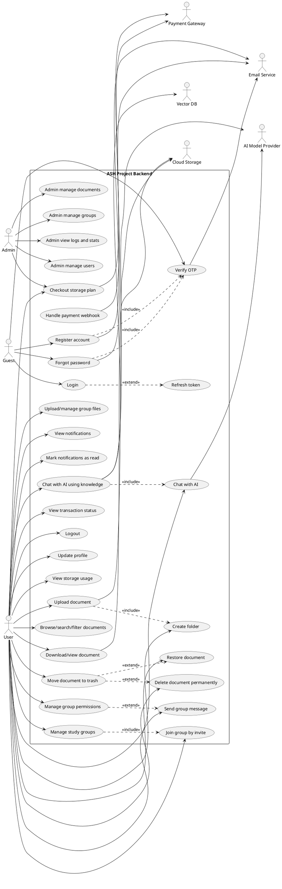

# ASH Project BE UML Summary

Source reading notes:
- `src/main/java/com/pctb/webapp/WebappApplication.java`
- `src/main/java/com/pctb/webapp/controller/*`
- `src/main/java/com/pctb/webapp/service/*`
- `src/main/java/com/pctb/webapp/entity/*`
- `README.md`

## 1) Class diagram

This backend is a layered Spring Boot application. The most useful UML class diagram is a logical one that groups controllers, services, repositories, and domain entities.

### Core classes

| Class | Responsibility |
|---|---|
| `AuthenController` | Auth endpoints: register, login, refresh token, logout, OTP, forgot password, Google login |
| `UserController` | User profile, storage usage, plan listing |
| `DocumentController` | Browse/search/filter/download/restore/delete documents |
| `DocumentUpLoadController` | Upload documents |
| `FolderController` | Create/list/delete folders |
| `GroupController` | Create/join/manage study groups and permissions |
| `GroupFileController` | Upload/manage group files |
| `GroupMessageController` | Send/list group messages |
| `NotificationController` | List notifications and mark as read |
| `PaymentController` | Checkout, webhook, transaction status |
| `AiChatController` | Direct AI chat and document-grounded chat |
| `AdminController` | Admin dashboard, logs, users, documents, groups, payments, AI stats |
| `TrashController` | Trash listing and cleanup |
| `AuthenService` | Registration, login, JWT, OTP, Google login, logout |
| `UserService` | Profile and storage info |
| `DocumentService` | Document lifecycle, search, trash, restore, download |
| `DocumentUploadService` | Upload orchestration |
| `FolderService` | Folder lifecycle |
| `GroupService` | Group lifecycle, membership, permissions, invite flow |
| `GroupFileService` | Group file lifecycle |
| `GroupMessageService` | Group chat messages |
| `NotificationService` | Notification creation and read-state management |
| `PaymentService` | Transaction creation and payment processing |
| `AiChatService` | AI chat and knowledge retrieval |
| `StorageService` | Storage abstraction |
| `CloudinaryStorageService` | Cloudinary-backed storage implementation |
| `RedisService` | Redis cache/session/token/OTP support |
| `MailService` | Email delivery |
| `QdrantService` | Vector retrieval for AI knowledge search |
| `DocumentIndexingService` | Index document content for AI search |
| `FileValidationService` | File type/extension validation |
| `LogService` | System log access |
| `StoragePlan` | Subscription/storage plan entity |
| `User` | Application user |
| `Role` | RBAC role |
| `Document` | Personal document |
| `Folder` | User folder hierarchy |
| `StudyGroup` | Private study group |
| `GroupMember` | User membership in a group |
| `GroupFile` | File shared inside a group |
| `GroupMessage` | Group chat message |
| `Notification` | User notification |
| `Transaction` | Payment transaction |
| `UserLoginHistory` | Login audit history |
| `SystemLog` | Admin/system log |

### Important relationships

- `User` many-to-many `Role`
- `User` one-to-many `Document`
- `User` one-to-many `Folder`
- `Folder` self-association to parent `Folder`
- `StudyGroup` many-to-one `User` as owner
- `GroupMember` many-to-one `StudyGroup`
- `GroupMember` many-to-one `User`
- `GroupFile` many-to-one `StudyGroup`
- `GroupFile` many-to-one `User` as uploader
- `Notification` many-to-one `User` as receiver
- `Notification` many-to-one `User` as actor
- `Transaction` many-to-one `User`
- `Transaction` many-to-one `StoragePlan`
- `Document` many-to-one `User` as owner
- `Document` many-to-one `Folder`

### PlantUML class diagram

```plantuml
@startuml
skinparam classAttributeIconSize 0

class AuthenController
class UserController
class DocumentController
class DocumentUpLoadController
class FolderController
class GroupController
class GroupFileController
class GroupMessageController
class NotificationController
class PaymentController
class AiChatController
class AdminController
class TrashController

class AuthenService
class UserService
class DocumentService
class DocumentUploadService
class FolderService
class GroupService
class GroupFileService
class GroupMessageService
class NotificationService
class PaymentService
class AiChatService
class RedisService
class MailService
class QdrantService
class DocumentIndexingService
class FileValidationService
class StorageService
class CloudinaryStorageService
class LogService

class User
class Role
class Document
class Folder
class StudyGroup
class GroupMember
class GroupFile
class GroupMessage
class Notification
class Transaction
class StoragePlan
class UserLoginHistory
class SystemLog

enum GroupRole
enum RoleEnum
enum NotificationType
enum TransactionStatus
enum UploadStatus

AuthenController --> AuthenService
AuthenController --> RedisService
UserController --> UserService
UserController --> PaymentService
DocumentController --> DocumentService
DocumentUpLoadController --> DocumentUploadService
FolderController --> FolderService
GroupController --> GroupService
GroupFileController --> GroupFileService
GroupMessageController --> GroupMessageService
NotificationController --> NotificationService
PaymentController --> PaymentService
AiChatController --> AiChatService
AdminController --> LogService
AdminController --> UserService
AdminController --> DocumentService
AdminController --> GroupService
AdminController --> PaymentService
AdminController --> AiChatService
TrashController --> TrashService

AuthenService --> User
AuthenService --> RedisService
AuthenService --> MailService
AuthenService --> UserLoginHistory
AuthenService --> Role
AuthenService --> RoleEnum

UserService --> User
UserService --> StoragePlan

DocumentService --> Document
DocumentService --> Folder
DocumentService --> User
DocumentService --> StorageService
DocumentService --> FileValidationService
DocumentService --> QdrantService
DocumentService --> DocumentIndexingService

DocumentUploadService --> DocumentService
DocumentUploadService --> StorageService
DocumentUploadService --> FileValidationService

FolderService --> Folder
FolderService --> User

GroupService --> StudyGroup
GroupService --> GroupMember
GroupService --> User
GroupService --> NotificationService
GroupService --> GroupRole
GroupService --> NotificationType

GroupFileService --> GroupFile
GroupFileService --> StudyGroup
GroupFileService --> User
GroupFileService --> StorageService

GroupMessageService --> GroupMessage
GroupMessageService --> StudyGroup
GroupMessageService --> User

NotificationService --> Notification
NotificationService --> User
NotificationService --> GroupMember
NotificationService --> NotificationType

PaymentService --> Transaction
PaymentService --> StoragePlan
PaymentService --> User
PaymentService --> TransactionStatus

AiChatService --> Document
AiChatService --> Folder
AiChatService --> QdrantService
AiChatService --> DocumentIndexingService

CloudinaryStorageService ..|> StorageService

User --> Role
Document --> User
Document --> Folder
Folder --> User
Folder --> Folder : parent
StudyGroup --> User : owner
GroupMember --> StudyGroup
GroupMember --> User
GroupFile --> StudyGroup
GroupFile --> User : uploadedBy
Notification --> User : receiverUser
Notification --> User : actorUser
Transaction --> User
Transaction --> StoragePlan
UserLoginHistory --> User

@enduml
```

## 2) Use case diagram

### Actors

- `Guest`
- `User`
- `Admin`
- `Payment Gateway`
- `Email Service`
- `Cloud Storage`
- `AI Model Provider`
- `Vector DB`

### Main use cases

- `Register account`
- `Verify OTP`
- `Login`
- `Refresh token`
- `Logout`
- `Forgot password`
- `Update profile`
- `View storage usage`
- `Upload document`
- `Browse/search/filter documents`
- `Download/view document`
- `Move document to trash`
- `Restore document`
- `Delete document permanently`
- `Create folder`
- `Manage study groups`
- `Join group by invite`
- `Manage group permissions`
- `Upload/manage group files`
- `Send group message`
- `View notifications`
- `Mark notifications as read`
- `Chat with AI`
- `Chat with AI using knowledge`
- `Checkout storage plan`
- `Handle payment webhook`
- `View transaction status`
- `Admin manage users`
- `Admin manage documents`
- `Admin manage groups`
- `Admin view logs and stats`

### PlantUML use case diagram

## 3) Notes for Visual Paradigm

If you want a clean diagram for school/project submission, keep the model at this level:

- 1 system boundary: `ASH Project Backend`
- 3 controller clusters: auth/user, document/group, admin/payment/AI
- 6 to 8 domain entities only: `User`, `Document`, `Folder`, `StudyGroup`, `GroupMember`, `Notification`, `Transaction`, `StoragePlan`
- 7 actors only: `Guest`, `User`, `Admin`, `Payment Gateway`, `Email Service`, `Cloud Storage`, `AI Model Provider`

That gives you a diagram that is accurate without being too crowded.

