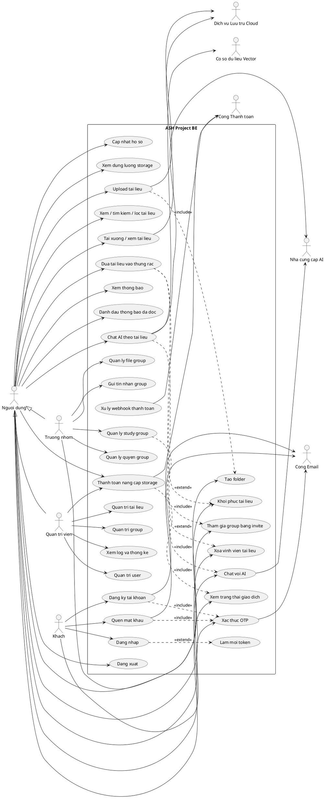

# ASH Project BE - UML Diagrams

Mình chọn hướng làm theo **code thật + business rules** để sơ đồ vừa đủ đầy đủ cho dự án, vừa không bị rối:
- `Class diagram`: ưu tiên **danh từ / thực thể / thành phần hệ thống**, không dùng tên kiểu động từ.
- `Use case diagram`: tách **actor rõ ràng** để không nhầm giữa khách, người dùng, trưởng nhóm, admin và các hệ thống ngoài.

## 1) Class diagram

### Phạm vi nên đưa vào

#### Tầng giao tiếp
- `AuthenController`
- `UserController`
- `DocumentController`
- `DocumentUpLoadController`
- `FolderController`
- `GroupController`
- `GroupFileController`
- `GroupMessageController`
- `NotificationController`
- `PaymentController`
- `AiChatController`
- `AdminController`
- `TrashController`

#### Tầng nghiệp vụ
- `AuthenService`
- `OtpService`
- `UserService`
- `DocumentService`
- `DocumentUploadService`
- `FolderService`
- `GroupService`
- `GroupFileService`
- `GroupMessageService`
- `NotificationService`
- `PaymentService`
- `AiChatService`
- `TrashService`
- `RedisService`
- `MailService`
- `FileValidationService`
- `StorageService`
- `CloudinaryStorageService`
- `DocumentIndexingService`
- `DocumentTextExtractorService`
- `QdrantService`
- `LogService`

#### Thực thể miền
- `User`
- `Role`
- `Document`
- `Folder`
- `StudyGroup`
- `GroupMember`
- `GroupFile`
- `GroupMessage`
- `Notification`
- `Transaction`
- `StoragePlan`
- `UserLoginHistory`
- `SystemLog`

#### Kiểu dữ liệu / enum
- `GroupRole`
- `RoleEnum`
- `NotificationType`
- `TransactionStatus`
- `UploadStatus`

### Quan hệ chính

- `User` nhiều-nhiều `Role`
- `User` một-nhiều `Document`
- `User` một-nhiều `Folder`
- `Folder` tự liên kết với `Folder` cha
- `StudyGroup` nhiều-một `User` theo vai trò `owner`
- `GroupMember` nhiều-một `StudyGroup`
- `GroupMember` nhiều-một `User`
- `GroupFile` nhiều-một `StudyGroup`
- `GroupFile` nhiều-một `User` theo `uploadedBy`
- `Notification` nhiều-một `User` theo `receiverUser`
- `Notification` nhiều-một `User` theo `actorUser`
- `Transaction` nhiều-một `User`
- `Transaction` nhiều-một `StoragePlan`
- `Document` nhiều-một `User` theo `owner`
- `Document` nhiều-một `Folder`

### PlantUML class diagram

```plantuml
@startuml
skinparam classAttributeIconSize 0
hide circle

class AuthenController
class UserController
class DocumentController
class DocumentUpLoadController
class FolderController
class GroupController
class GroupFileController
class GroupMessageController
class NotificationController
class PaymentController
class AiChatController
class AdminController
class TrashController

class AuthenService
class OtpService
class UserService
class DocumentService
class DocumentUploadService
class FolderService
class GroupService
class GroupFileService
class GroupMessageService
class NotificationService
class PaymentService
class AiChatService
class TrashService
class RedisService
class MailService
class FileValidationService
class StorageService
class CloudinaryStorageService
class DocumentIndexingService
class DocumentTextExtractorService
class QdrantService
class LogService

class User
class Role
class Document
class Folder
class StudyGroup
class GroupMember
class GroupFile
class GroupMessage
class Notification
class Transaction
class StoragePlan
class UserLoginHistory
class SystemLog

enum GroupRole
enum RoleEnum
enum NotificationType
enum TransactionStatus
enum UploadStatus

AuthenController --> AuthenService
AuthenController --> OtpService
UserController --> UserService
UserController --> PaymentService
DocumentController --> DocumentService
DocumentUpLoadController --> DocumentUploadService
FolderController --> FolderService
GroupController --> GroupService
GroupFileController --> GroupFileService
GroupMessageController --> GroupMessageService
NotificationController --> NotificationService
PaymentController --> PaymentService
AiChatController --> AiChatService
AdminController --> UserService
AdminController --> DocumentService
AdminController --> GroupService
AdminController --> PaymentService
AdminController --> AiChatService
AdminController --> LogService
TrashController --> TrashService

AuthenService --> User
AuthenService --> Role
AuthenService --> UserLoginHistory
AuthenService --> RedisService
AuthenService --> MailService
AuthenService --> OtpService

OtpService --> RedisService
OtpService --> User
OtpService --> Role
OtpService --> MailService

UserService --> User
UserService --> Document
UserService --> StoragePlan
UserService --> CloudinaryStorageService

DocumentService --> Document
DocumentService --> Folder
DocumentService --> User
DocumentService --> StorageService
DocumentService --> FileValidationService
DocumentService --> QdrantService
DocumentService --> DocumentIndexingService

DocumentUploadService --> Document
DocumentUploadService --> Folder
DocumentUploadService --> User
DocumentUploadService --> StorageService
DocumentUploadService --> FileValidationService
DocumentUploadService --> DocumentIndexingService
DocumentUploadService --> DocumentTextExtractorService
DocumentUploadService --> QdrantService
DocumentUploadService --> LogService

FolderService --> Folder
FolderService --> User

GroupService --> StudyGroup
GroupService --> GroupMember
GroupService --> User
GroupService --> NotificationService
GroupService --> GroupRole
GroupService --> NotificationType

GroupFileService --> GroupFile
GroupFileService --> StudyGroup
GroupFileService --> User
GroupFileService --> StorageService

GroupMessageService --> GroupMessage
GroupMessageService --> StudyGroup
GroupMessageService --> User

NotificationService --> Notification
NotificationService --> User
NotificationService --> GroupMember
NotificationService --> NotificationType

PaymentService --> Transaction
PaymentService --> StoragePlan
PaymentService --> User
PaymentService --> TransactionStatus

AiChatService --> Document
AiChatService --> Folder
AiChatService --> QdrantService
AiChatService --> DocumentTextExtractorService

TrashService --> Document
TrashService --> Folder

CloudinaryStorageService ..|> StorageService

User --> Role
Document --> User : owner
Document --> Folder
Folder --> User : owner
Folder --> Folder : parent
StudyGroup --> User : owner
GroupMember --> StudyGroup
GroupMember --> User
GroupFile --> StudyGroup
GroupFile --> User : uploadedBy
GroupMessage --> StudyGroup
GroupMessage --> User : sender
Notification --> User : receiverUser
Notification --> User : actorUser
Transaction --> User
Transaction --> StoragePlan
UserLoginHistory --> User

@enduml
```

## 2) Use case diagram

### Actor tách rõ

- `Khách`
- `Người dùng`
- `Trưởng nhóm`
- `Quản trị viên`
- `Cổng Email`
- `Dịch vụ Lưu trữ Cloud`
- `Cổng Thanh toán`
- `Nhà cung cấp AI`
- `Cơ sở dữ liệu Vector`

### Quy ước tách actor

- `Người dùng` là actor nền tảng cho các chức năng cá nhân.
- `Trưởng nhóm` là vai trò chuyên biệt của `Người dùng` với quyền quản lý group.
- `Quản trị viên` là vai trò chuyên biệt của `Người dùng` với quyền quản trị hệ thống.
- Các dịch vụ bên ngoài là actor riêng để không nhầm với chức năng nội bộ.

### Use case chính

- `Đăng ký tài khoản`
- `Xác thực OTP`
- `Đăng nhập`
- `Làm mới token`
- `Đăng xuất`
- `Quên mật khẩu`
- `Cập nhật hồ sơ`
- `Xem dung lượng storage`
- `Upload tài liệu`
- `Xem / tìm kiếm / lọc tài liệu`
- `Tải xuống / xem tài liệu`
- `Đưa tài liệu vào thùng rác`
- `Khôi phục tài liệu`
- `Xóa vĩnh viễn tài liệu`
- `Tạo folder`
- `Quản lý study group`
- `Tham gia group bằng invite`
- `Quản lý quyền group`
- `Quản lý file group`
- `Gửi tin nhắn group`
- `Xem thông báo`
- `Đánh dấu thông báo đã đọc`
- `Chat với AI`
- `Chat AI theo tài liệu`
- `Thanh toán nâng cấp storage`
- `Xử lý webhook thanh toán`
- `Xem trạng thái giao dịch`
- `Quản trị user`
- `Quản trị tài liệu`
- `Quản trị group`
- `Xem log và thống kê`

### PlantUML use case diagram

## 3) Mình đánh giá phần này là đủ tốt cho dự án vì

- Bám sát code thật.
- Bao hết core business rules của file bạn gửi.
- Actor use case không bị nhập nhằng.
- Class diagram chỉ dùng thành phần dạng danh từ, dễ chép vào Visual Paradigm.

Nếu bạn muốn, mình có thể làm tiếp bản **rút gọn để nộp nhanh** hoặc bản **vẽ chi tiết từng module**.

